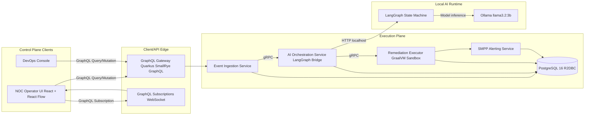
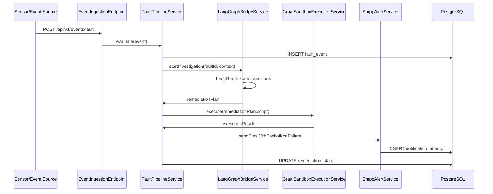

# Fabric Engine Next-Gen - HLD and LLD

## 1. High-Level Design (HLD)

### 1.1 Platform Intent
Fabric Engine Next-Gen is a reactive control-plane platform that transitions network operations from passive monitoring to autonomous infrastructure management. The architecture is optimized for low-latency startup, deterministic event processing, and AI-assisted remediation loops.

### 1.2 Non-Functional Targets
- Native cold start: `T_startup <= 50 ms` (Quarkus + GraalVM native image)
- Runtime memory footprint: `M_runtime < 100 MB` per service instance
- Event throughput: `lambda_events >= 5000 events/sec`
- Tier-1 automated remediation: `R_auto >= 0.60`
- GraphQL payload reduction: `Delta_payload >= 0.40` versus REST baseline

### 1.3 Core Architecture

### 1.4 Communication Model
- Client-to-server: GraphQL (queries/mutations/subscriptions)
- Internal service-to-service: gRPC with protobuf contracts and deadline budgets
- AI local calls: loopback HTTP between orchestration bridge and LangGraph + Ollama runtime

### 1.5 Event Ingestion Scaling Equations
Given:
- `lambda`: incoming event rate (events/sec)
- `mu`: processing rate per worker (events/sec)
- `k`: worker concurrency
- `rho = lambda / (k * mu)` utilization

Stability condition:
- `rho < 1`

For target headroom `h = 0.70`:
- `k_min = ceil(lambda / (h * mu))`

Example with `lambda = 5000` and `mu = 220`:
- `k_min = ceil(5000 / (0.70 * 220)) = ceil(32.47) = 33`

p95 processing latency estimate (M/M/k approximation):
- `Wq ~= P_wait / (k * mu - lambda)`
- `W ~= Wq + 1/mu`

Subscription fan-out bandwidth:
- `B_out = N_subscribers * E_delta * f_update`
- where `E_delta` is bytes per GraphQL delta payload and `f_update` is update frequency.

## 2. Low-Level Design (LLD)

### 2.1 Backend Modules (Quarkus 3.x Native)
- `api`: GraphQL endpoint and fault ingestion REST endpoint
- `service`: fault evaluation, orchestration triggering, remediation dispatch
- `integration`: LangGraph bridge, SMPP sender, gRPC client stubs
- `sandbox`: GraalVM polyglot execution isolation (CPU-bound only)
- `persistence`: reactive repositories using PostgreSQL 16 + R2DBC

### 2.2 Fault-to-Remediation Sequence

### 2.3 gRPC Contract Domains
- `FaultOrchestrationService`: `StartInvestigation`, `GetInvestigationState`
- `RemediationExecutionService`: `ExecutePlan`, `GetExecutionStatus`
- `TelemetryAggregationService`: `PushTelemetryBatch`

### 2.4 GraphQL Schema Domains
- `Query`: topology nodes/edges, incident history, remediation timeline
- `Mutation`: acknowledge fault, trigger manual remediation
- `Subscription`: `faultStream`, `remediationLogStream`, `topologyDeltaStream`

### 2.5 Runtime Isolation Policy (GraalVM)
- `allowIO(false)` and `allowHostAccess(NONE)`
- `allowHostClassLookup(className -> false)`
- CPU-bound execution with bounded wall time via executor + timeout
- per-run context creation and teardown for zero state leakage

### 2.6 Data Model Snapshot
- `fault_event(id, source, severity, cpu_usage, observed_at, payload_json, status)`
- `remediation_run(id, fault_id, plan_json, state, started_at, completed_at)`
- `notification_attempt(id, remediation_run_id, channel, attempt_no, status, response, created_at)`

### 2.7 Native Build Flags
- Quarkus profile: `-Dquarkus.package.type=native`
- Target startup validation in CI: assert `startup_time_ms <= 50`
- Memory budget gate: assert RSS under 100MB for idle profile

