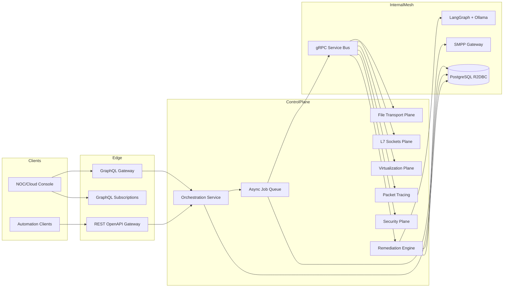
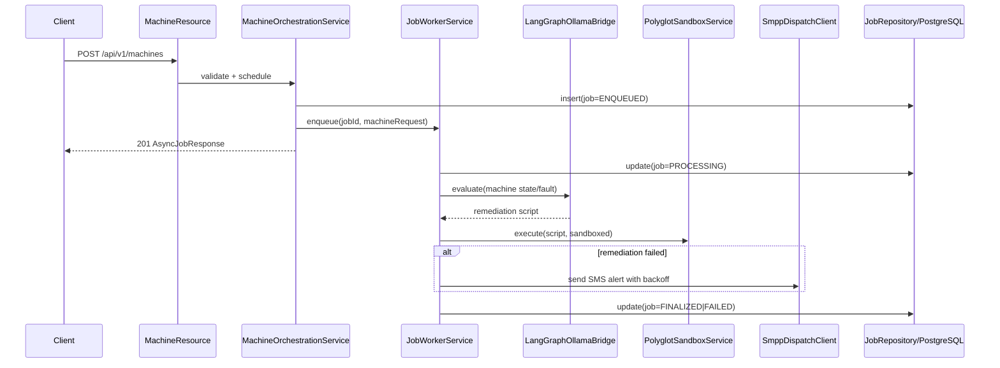

# Fabric Engine Next-Gen HLD & LLD

## HLD

### Architecture Goals
- Unified control-plane for compute, virtualization, security, file transport, and quantum workloads.
- Dual ingress: GraphQL for client reactivity and gRPC for internal high-throughput service mesh.
- Quarkus 3.x + GraalVM native runtime targets: cold start <50ms, memory <100MB.
- Sustained event pipeline >= 5,000 events/sec.

### Core Topology

### Throughput/Scaling Model
- Utilization: `rho = lambda / (k * mu)`
- Stability: `rho < 1`
- Worker floor: `k >= ceil(lambda / (h * mu))`, `h` = target headroom.
- For `lambda=5000`, `mu=250`, `h=0.7` => `k=29` workers.

## LLD

### Request Lifecycle (`POST /machines`)

### Internal Components
- `MachineResource`: contract boundary for `/machines` + `/machines/{machineId}/hardware`.
- `MachineOrchestrationService`: request validation, idempotency, job creation.
- `JobWorkerService`: async execution worker and status transition management.
- `LangGraphOllamaBridge`: localized reasoning state-machine bridge.
- `PolyglotSandboxService`: no-host, no-IO GraalVM script execution.
- `SmppDispatchClient`: resilient operational alerting with exponential backoff.
- `JobRepository`: reactive storage and query API.

### Data Objects
- `MachineProvisionRequest`
- `HardwareUpdateRequest`
- `AsyncJobResponse`
- `AlertTrigger`
- `ExecutionResult`

